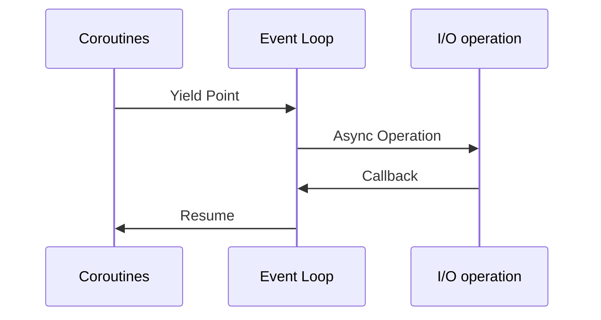

## Concurrency and Parallelism

### Concurrency

Concurrency is the ability of a system to handle multiple tasks or operations simultaneously, often by interleaving them. 
In programming, concurrency allows a system to make progress on more than one task at a time, improving efficiency, 
responsiveness, and resource utilization. However, it doesn't necessarily mean that tasks are running in parallel; 
instead, the system switches between tasks, giving the appearance of parallel execution.

For example, consider a web server handling multiple client requests. Without concurrency, the server would process 
each request one after another, waiting for one to finish before starting the next. With concurrency, the server can 
begin processing one request, pause while waiting for data (e.g., from a database), and in the meantime, start working 
on another request.

### Parallelism
Parallelism refers to the simultaneous execution of multiple tasks or processes. In parallelism, tasks truly run at the same time, typically on different CPU cores or machines. Each task gets its own dedicated processing resource, allowing the system to perform multiple computations in parallel without switching between them.

For example, if you have a multicore processor, parallelism allows two tasks to run on separate cores at the exact same time, such as one core processing a database query while another core processes an image.

### Key Differences


*Illustration from [this article](https://medium.com/@deepshig/concurrency-vs-parallelism-4a99abe9efb8)*

Here is a table showing key differences between concurrency and parallelism

| **Aspect**             | **Concurrency**                                                                 | **Parallelism**                                                              |
|------------------------|---------------------------------------------------------------------------------|------------------------------------------------------------------------------|
| **Nature of Execution** | Tasks are interleaved, giving the illusion of simultaneous execution.            | Tasks are executed simultaneously on separate processing resources.          |
| **Resources**           | Typically uses a single core or CPU, switching between tasks (time slicing).     | Requires multiple cores, processors, or machines to execute tasks at the same time. |
| **Objective**           | Manage multiple tasks and ensure progress on all of them, optimizing responsiveness. | Speed up execution by performing tasks simultaneously, reducing execution time. |
| **Example**             | A web server handling multiple requests, switching between them.                 | Data analysis on multiple data sets on separate CPU cores at the same time.   |

---

## What is the GIL?

The **Global Interpreter Lock (GIL)** is a mutex (or a lock) used in **CPython**, the most widely used implementation 
of Python. Its purpose is to allow only one thread to execute Python bytecode at a time, even if a program uses multiple
threads. This means that no matter how many threads you create in a Python program, only one of them can execute Python 
code at any given moment.

### Why Does Python Use the GIL?

- **Memory Management Simplicity**:  
  The GIL simplifies the memory management system in Python. Python uses reference counting to track when objects are 
  no longer needed so they can be cleaned up (garbage collected). Without the GIL, the reference count of an object 
  could be changed by multiple threads simultaneously, leading to data corruption or crashes. The GIL ensures that 
  reference count updates and object management are safe.

- **Performance in Single-Threaded Programs**:  
  When Python was originally designed, it was primarily a single-threaded language. The GIL was added to make 
  single-threaded performance faster and simpler. While this choice works well for single-threaded programs, it poses 
  problems for multi-threaded applications, especially on multi-core systems.

- **Backward Compatibility**:  
  Removing the GIL would require significant changes to CPython's core. Many libraries and existing code depend on the 
  GIL's behavior, making its removal a complex task that would break compatibility with older Python programs.

### Python Threading and the GIL

In traditional systems (without a GIL), **threads** are considered separate, independent units of execution that can 
run in parallel, particularly on multi-core processors. In these systems, each thread can execute concurrently, taking 
advantage of multiple CPU cores to perform multiple tasks at the same time.

However, Python’s **threading** library behaves differently due to the presence of the GIL:

#### Concurrency or Parallelism? 
Python threads can still provide **concurrency**, but they do not achieve true **parallelism** for CPU-bound tasks 
because the GIL prevents more than one thread from running Python code at once. Even on a machine with multiple cores, 
only one thread executes Python bytecode at any given time.

#### CPU-bound and I/O-bound

Process execution consists of a cycle of CPU execution and I/O wait.
Process alternate between these two states.

* **CPU-burst**: the amount of time the process performs **CPU-bound work** refers to tasks that require intense use of
  the processor,
  where the CPU is the main limiting factor for performance. Examples include mathematical computations, data
  processing,
  and running algorithms.

* **I/O-burst**: the time that a process spends for waiting for a completion of the **I/O-bound work** refers to tasks
  limited by input/output operations, such as reading from disk, network requests, or database queries.


*Illustration from [this article](https://www.baeldung.com/cs/cpu-io-bound)*

Attempt to apply threading to a **CPU-bound** application suffers from the GIL
because only one thread can execute at a time, preventing full utilization of multicore CPUs.

While one thread is waiting for I/O operations to complete, the GIL is released, allowing another thread to execute.
Thus, Python’s threading model works well for programs that perform a lot of I/O waiting (like web servers),
even if they don’t achieve true parallelism.

            
#### Python Threads vs Traditional threads

Here’s a breakdown of the differences between Python threads and traditional threads:

| **Python Threads (with GIL)**               | **Traditional Threads**                        |
| ------------------------------------------- | --------------------------------------------- |
| Only one thread can execute Python bytecode at a time. | Threads can run in parallel across CPU cores. |
| Threads are suitable for I/O-bound tasks (file I/O, network). | Threads are suitable for both I/O-bound and CPU-bound tasks. |
| CPU-bound tasks do not benefit from threading due to the GIL. | CPU-bound tasks can fully utilize multi-core CPUs. |
| Python threads are managed by the OS but limited by the GIL. | OS schedules threads to run independently on multiple cores. |

!!! example

    Let’s look at an example of how the GIL affects Python threading when performing CPU-bound tasks:
    
    ```python
    import threading
    
    def cpu_bound_task():
        result = 0
        for i in range(10000000):
            result += i
        print(f"Result: {result}")
    
    threads = []
    for _ in range(4):
        t = threading.Thread(target=cpu_bound_task)
        threads.append(t)
        t.start()
    
    for t in threads:
        t.join()
    ```
    
    In this case, while one thread is waiting for the response from a server (I/O operation), other threads can run, 
    resulting in better concurrency. The GIL is not a significant bottleneck in I/O-bound operations.

### How to Overcome GIL Limitations
While the GIL limits Python’s threading model for CPU-bound tasks, there are several ways to work around it:

* Multiprocessing:
    The `multiprocessing` module in Python allows you to create separate processes, each with its own Python interpreter and memory space. Since each process has its own GIL, they can run in parallel on multiple CPU cores. This is the preferred approach for CPU-bound tasks.
    ```python 
    from multiprocessing import Process
    
    def cpu_bound_task():
        result = 0
        for i in range(10000000):
            result += i
        print(f"Result: {result}")
    
    processes = []
    for _ in range(4):
        p = Process(target=cpu_bound_task)
        processes.append(p)
        p.start()
    
    for p in processes:
        p.join()
    ```  
    Using multiprocessing, you can fully utilize multiple CPU cores for CPU-bound tasks since each process operates independently.
* Other Python Implementations:
  If the GIL is a significant limitation, you can consider using other Python implementations like Jython
  (Python for the JVM) or IronPython (Python for .NET), which do not have a GIL and can achieve true parallelism with
  threads.
  However, these implementations are less commonly used and have different ecosystems from CPython.
* C Extensions:
  For performance-critical sections of code, you can write C extensions, which can release the GIL during computation.
  This allows you to take advantage of multicore processors in Python, but requires writing C code and managing the
  interaction between Python and C.

/// info
**NumPy (Numerical Python)** is an open source Python library that's widely used in science and engineering.
It is mostly written in C.
///


---

## `async` and `await`

### Sync/Async
Synchronous (sync) and asynchronous (async) programming refer to different approaches in handling the execution of code, particularly how input/output (I/O) operations are managed in relation to time and other tasks.

#### Synchronous Programming
In synchronous programming, I/O tasks are executed one after another in a sequential manner. Each I/O operation must be completed before the next one begins. This means the program follows a predictable order, where the completion of a task fully blocks the program's flow until it finishes. In other words, the program "waits" for each I/O operation to complete before moving to the next.

**Key aspects:**

- Sequential execution: The next step doesn’t start until the current one finishes, especially when dealing with I/O tasks.
  
- Blocking: An I/O operation can block the entire program from proceeding until it completes, such as waiting for a file to be read or data from a network to arrive.

- Simple to reason about: Since I/O tasks are executed one after another, it's easier to understand how data flows between steps.

#### Asynchronous Programming
Asynchronous programming, on the other hand, allows multiple I/O tasks to be in progress at the same time without having to wait for one to finish before starting another. This involves running tasks independently or scheduling them in a way that allows for concurrency. Instead of waiting for an I/O operation to finish, the program can proceed to other tasks and handle the result of the previous task once it's ready.

**Key aspects:**

- Non-blocking: I/O tasks don’t stop the program's flow, allowing other operations to be executed while waiting for the I/O result, such as performing other computations while waiting for a network response.

- Concurrency: Multiple I/O operations can be initiated, and their completion times are managed independently.

- Requires more complex reasoning: Since I/O tasks are handled out of order, you need to track when and how different operations complete.

### Asynchronous Programming in Python 

Python introduced the `asyncio` module in Python 3.4, and starting from Python 3.5, the `async`** and `await`
keywords were introduced to write asynchronous code in a clean, readable manner. These tools allow developers to 
implement concurrency using coroutines without the complexities of threads or processes.

#### Coroutines

A **coroutine** is a function that can be paused and resumed. In Python, you define a coroutine using the `async def` 
syntax. Coroutines are the foundation of asynchronous programming in Python.

Here’s an example:

```python
import asyncio

async def say_hello():
    print("Hello")
    await asyncio.sleep(1)  # Simulate a non-blocking delay
    print("World")
```

In this example, `say_hello` is an asynchronous function. The `await` keyword tells the function to "pause" its execution 
and wait for the result of `asyncio.sleep(1)`, which simulates a one-second delay without blocking other tasks.

#### Running Coroutines

To run a coroutine, you can use `asyncio.run()`:

```python
import asyncio

async def main():
    await say_hello()

asyncio.run(main())
```

The `await` keyword is essential when calling another coroutine. It suspends the current coroutine until the awaited 
coroutine completes, allowing other tasks to be executed during that time.

#### Asyncio Event Loop

At the heart of Python’s asynchronous programming model is the **event loop**.
The event loop is responsible for managing the execution of coroutines, handling I/O operations, and scheduling tasks.



Here's how the event loop works:     

- The event loop runs coroutines until they hit an `await` (such as I/O, network call, or a timer).
- When a coroutine is suspended at an `await`, the event loop picks up another coroutine and runs it.
- Once the awaited task completes, the event loop returns to the paused coroutine and resumes it.

You can think of the event loop as a conductor, coordinating when each coroutine gets a turn to execute.

#### Benefits of `async/await` in Python

* **Non-blocking I/O Operations**  
    `async/await` shines in scenarios where I/O operations (e.g., network requests, file handling) are frequent. 
    In traditional synchronous programming, tasks would block the main thread while waiting for I/O operations to complete, 
    resulting in inefficiency. With `async/await`, your program can handle I/O-bound tasks concurrently, making better 
    use of resources.

    !!! example
        Consider a program that needs to download multiple web pages:

        **Synchronous Version:**
        
        ```python
        import requests
        
        def download_page(url):
           response = requests.get(url)
           return response.text
        
        for url in urls:
           page = download_page(url)
           print(f"Downloaded {len(page)} characters")
        ```
      
        **Asynchronous Version:**
        
        ```python
        import httpx
        import asyncio
        
        async def download_page(session, url):
           async with session.get(url) as response:
               return await response.text()
        
        async def main():
           async with httpx.Client() as session:
               tasks = [download_page(session, url) for url in urls]
               pages = await asyncio.gather(*tasks)
               for page in pages:
                   print(f"Downloaded {len(page)} characters")
        
        asyncio.run(main())
        ```
        
        In the asynchronous version, multiple pages can be downloaded concurrently, improving the overall performance, 
        especially for I/O-bound tasks. In contrast, `async/await` allows the program to switch between tasks when it hits an I/O operation.

* **Simplified Syntax**  
  Without `async/await`, handling concurrency would require more complex techniques, such as using threads or
  callback-based approaches.
  Threads introduce additional complexity with context switching, synchronization, and debugging challenges.

* **Lower Memory Usage**  
   `asyncio`-based coroutines are lightweight compared to threads. They consume fewer resources because they don’t 
   involve OS-level threads, and switching between coroutines is much cheaper than switching between threads. This 
   means that you can handle a large number of concurrent tasks (like thousands of web requests) with significantly 
   less memory overhead.

///info
Before, in some languages, asynchronous programming often involved callbacks to achive concurrency, which could lead to
deeply nested code, known
as "callback hell." `async/await` provides a linear, more intuitive flow of code while retaining the benefits of
concurrency.
///

Here is a table illustrating the differences between `asyncio`, `multithreading`, and `multiprocessing`.

| Aspect                        | asyncio                                  | multithreading                          | multiprocessing                        |
|-------------------------------|------------------------------------------|-----------------------------------------|----------------------------------------|
| Type of Concurrency           | Cooperative (single-threaded)            | Preemptive (multiple threads)           | Preemptive (multiple processes)        |
| Use Case                      | I/O-bound tasks                          | I/O-bound tasks                         | CPU-bound tasks                        |
| Parallelism                   | No (single-threaded)                     | Limited (due to GIL)                    | Yes (multiple processes)               |
| GIL (Global Interpreter Lock) | Not affected (no threads)                | Affected (limits CPU-bound tasks)       | Not affected (separate processes)      |
| Memory Sharing                | Shared memory (single thread)            | Shared memory (between threads)         | No shared memory (separate processes)  |
| Performance (CPU-bound)       | No                                       | No (limited by GIL)                     | No (best for CPU-bound)                |
| Performance (I/O-bound)       | Yes (ideal for I/O-bound tasks)          | Yes (good for I/O-bound tasks)          | No (overhead from process management)  |
| Overhead                      | Low (single event loop)                  | Low (threads are lightweight)           | High (process creation is expensive)   |
| Communication Mechanism       | Async events, queues, or futures         | Locks, conditions, and queues           | Pipes, queues, shared memory           |
| Ease of Debugging             | Yes (simpler due to single-thread)       | No (harder due to thread complexity)    | No (harder due to process separation)  |
| Fault Tolerance               | No (single point of failure)             | No (crash affects all threads)          | Yes (crash in one process is isolated) |
| Context Switching Cost        | Minimal (no thread switching)            | Moderate (thread switching)             | High (process switching)               |
| Scalability                   | Good for handling many I/O tasks         | Limited by GIL                          | Excellent for scaling CPU-bound tasks  |
| Best For                      | Web servers, networking, I/O-bound tasks | Background tasks, I/O-bound parallelism | Heavy CPU-bound computation tasks      |

     
---

## Conclusion

### Choosing between asyncio and multithreading:

- `asyncio`:
    - Best for handling many concurrent I/O-bound tasks that can benefit from non-blocking code. It's more efficient for
      lightweight concurrency with low overhead.
    - Easier debugging and management of concurrency, as it operates within a single thread.

- `multithreading`:
    - Suitable for blocking I/O tasks where libraries don't offer async versions, or when you need to integrate
      synchronous code easily.
    - Works well when mixing I/O-bound and some CPU-bound tasks, without needing extensive refactoring to make the code
      asynchronous.

### Choosing multiprocessing:

- Best when dealing with CPU-bound tasks that need to bypass the Global Interpreter Lock (GIL). This approach enables
  leveraging multiple CPU cores for true parallelism.
- Ideal for compute-heavy tasks where processes can run independently and benefit from separate memory spaces,
  minimizing the impact of Python’s GIL.