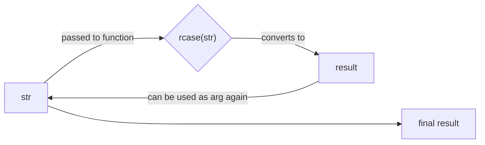
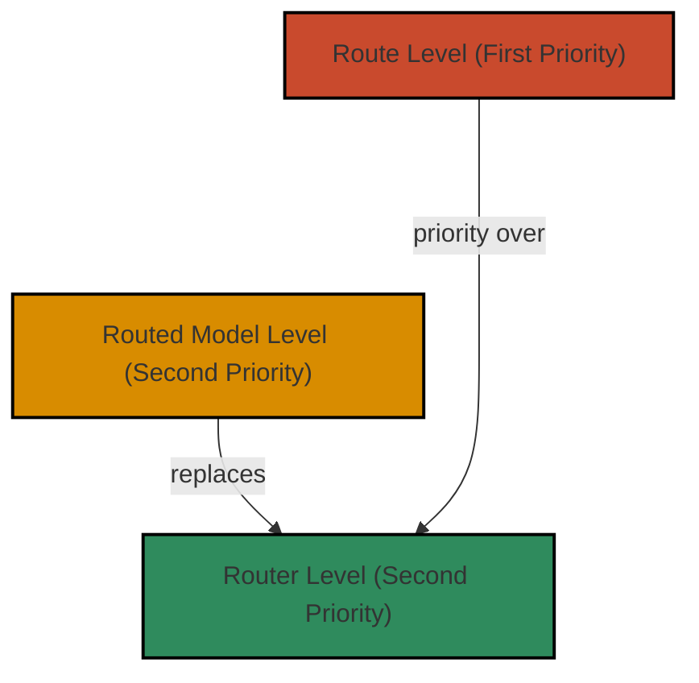

In some situations, we need to follow multiple naming conventions at the same time.
For instance, it's a common approach to convert fields of some structure from camelCase (or another case) to snake_case 
to follow Python’s naming conventions.

/// tip
If you don't know what are "snake_case", "camelCase", "Header-Case" and why you need to convert cases, visit 
[Motivation/Converting Case](/learn/user_guide/motivation.html#converting-case)
///

When you call [routed function(method)](/learn/user_guide/first_steps.html#routed-function),
Sensei collects argument names and add the corresponding key to request arguments.  

Assume, we have to make the following request:

```http
POST /users HTTP/1.1
Content-Type: application/json

{
    "firstName": "John Doe",
    "birthCity": "Manchester",
    ...
}
```

Since argument's name corresponds to key in [routed function's](/learn/user_guide/first_steps.html#routed-function) 
request arguments, you need to write this code:

```python
@router.post('/users')
def create_user(firstName: str, birthCity: str) -> User:
    ...
```

But this code violates python naming conventions. For instance, PyCharm warns you that "Argument name should be lowercase."
Because according to the conventions, arguments in Python should be of the snake_case. To resolve this issue, you can use 
**Case Converters**.

## Case Converters

**Case Converter** is a function that takes string of one case and converts it to string of another case and similar structure.

!!! example
    This function converts string to snake_case

    ```python
    def snake_case(s: str) -> str:
        s = re.sub('(.)([A-Z][a-z]+)', r'\1_\2', s)
        s = re.sub('([a-z0-9])([A-Z])', r'\1_\2', s)
        s = re.sub(r'\W+', '_', s).lower()
        s = re.sub(r'_+', '_', s)
        return s
    ```

Sensei has few built-in case converters: 
  
* snake_case
* camel_case
* pascal_case
* constant_case
* kebab_case
* header_case

They are all `closed` relative to each other. This means if
we take any case converter of provided, we can use it with any other supported case (case related to one of built-in 
case converter).

For instance, `snake_case("myString") == my_string`, `snake_case("MY_STRING") == my_string`, etc...

/// info
There is an explanation for **closure** property of case converters for math-lovers. 

^^Definition^^ *Let C = {f~1~, f~2~, ..., f~n~}*, is the set of functions, *f~i~ : D~i~ -> E~i~.*  
*If ∀ k, m ∈ {1, ..., n}* and *∀ x ∈  D~k~* condition *f~k~(x) ∈ D~m~* is met *=> {f~1~, f~2~, ..., f~n~}* **closed** 
relative to each other.

^^Corollary^^ *D~k~ = E~k~ = D~m~ = E~m~ = D ∀ k, m ∈ {1, ..., n} => {f~1~, f~2~, ..., f~n~}* **closed** relative to 
each other.
                      
Let's introduce an auxiliary function - *rcase(str) = random_case~C~(str)*. 
This is the function, that choose random case from C, and converts string `str` to chosen case. 
Here is illustration of this closure property.


///
             
**Case Converters** can be used for converting case of request parameters and keys of JSON response. 

But it's important to know, that case converters in the following three examples work only at the **first nesting level** 
without touching nested models. Let's explore how to apply converters. 


### Router (Router Level)
You can pass case converters as arguments to `Router` constructor. This process is called "applying case converters at 
Router level."  

`<param_type>` corresponds to the `<param_type>_case` argument in `Router` constructor, where `<param_type>` is
`path`, `query`, etc. And there is `response_case` that corresponds to the conversion of response fields.

Let's assume we have the API using camelCase:
      
```python
from sensei import Router, camel_case, snake_case

router = Router(
    'https://api.example.com',
    body_case=camel_case,
    response_case=snake_case
)

@router.post('/users')
def create_user(first_name: str, birth_city: str, ...) -> User: 
    ...
```

In arguments the example above converts `first_name` to `firstName`, `birth_city` to `birthCity`, etc. 

When parsing JSON response, the example performs the reverse process, that is converts 
`firstName` to `first_name`, `birthCity` to `birth_city`, etc. Here the original response case is camelCase, because we
assume that API is good-designed and keeps input ant output cases the same.  

/// info
Default value of `header_case` is `header_case` converter

```python
from sensei.cases import header_case as to_header_case

class Router(IRouter):
    def __init__(
        ...
        header_case: CaseConverter | None = to_header_case,    
    ):
```

Because headers are called this way:

- X-Token
- Content-Type
- etc...
///
      
### Route Decorator (Route Level)

You can pass case converters as arguments to [route decorator](/learn/user_guide/first_steps.html#routed-function). This process is called "applying case converters at 
Route level." These converters have higher priority, than [router level](#router-router-level) converters. 

Arguments, responsible for applying converters, have the same names as `Router` constructor.
        
!!! tip
    If API is bad-designed and follows different name conventions at the same time, you can use it. For instance,
    all endpoints accept request body with keys of kebab-case, but one "rogue" endpoint accepts keys with keys of
    camelCase. 

    ```python
    from sensei import Router, kebab_case, camel_case
    
    router = Router(
        'https://api.example.com',
        body_case=kebab_case
    )
    
    @router.post('/users', body_case=camel_case)
    def create_user(first_name: str, birth_city: str, ...) -> User: 
        ...
    ```

### Class Hooks (Routed Model level)

When you use [Routed Models](/learn/user_guide/routed_model.html) , you can define converters through hooks. 
`<param_type>` corresponds to `__<param_type>_case__` hook. This process is called "applying case converters at 
Routed Model level."   Let's look at the example below:

```python
router = Router(host, response_case=camel_case)

class User(APIModel):
    def __header_case__(self, s: str) -> str:
        return kebab_case(s)

    @staticmethod
    def __response_case__(s: str) -> str:
        return snake_case(s)

    @classmethod
    @router.get('/users/{id_}')
    def get(cls, id_: Annotated[int, Path(alias='id')]) -> Self: ...
```

Hook function can be represented both as instance method and as static method. 

/// warning
Don't interact with `self` argument in hooks. There it always has `None` value. This will be described later in 
[Routed Models](/learn/user_guide/routed_model.html)
///
   
So, `response_case=camel_case` in `Router`

```python
router = Router(host, response_case=camel_case)
```

Will be overriden by hook `__response_case__`

```python
@staticmethod
def __response_case__(s: str) -> str:
    return snake_case(s)
```

Consequently, this level has the same priority as [router level](#router-router-level), because it replaces it. As well 
as [router level](#router-router-level) level, it has lower priority than [route level](#route-decorator-route-level).
       
## Hook Levels (Priority)

Code that handles intercepted function calls, events or messages passed between software components is called a hook. 
The levels that were described above determine the scope of applying some hook. 
In the context of this article, hooks are the case converters.

* **Router Level**: apply hook to each routed function associated with that router
* **Route Level**: apply hook only to this routed function
* **Routed Model Level**: replaces Router Level, but defined in a routed model.
         
Moreover, there are different types of hook levels, each of which has special property. 
In the case of case converters, this type is called **Priority Levels**. Because, if multiple hooks are applied
to one target (routed function), only one will be executed, based on its priority. 
They can be described in that diagram:


    
## `AliasGenerator`
What if we need to apply Case Converters at the **deeper** nesting levels? Assume the API has two endpoints:
                                  
1) For getting bestseller of a specific year
    


2) And publishing book for a sale.


By some reasons, first endpoint returns response of camelCase, but second endpoint accepts a book of kebab case.
To follow python naming conventions, you have to make snake_case attributes. At the same time, you need to make only one model 
that can handle both the kebab-case and the camel_case, to follow [DRY](https://en.wikipedia.org/wiki/Don%27t_repeat_yourself).
                                       
/// info
Even if the case of the first and second endpoints are equal, you still would not be able to apply anything other than 
the approach described below, because the `Book` has a nested `Author` model. Cases are not equal only to show what are 
`validation_alias` and `serialization_alias` in one example.
///
     
You can't apply [CaseConverters](#case-converters) through [Router](/learn/user_guide/making_aliases.html#router) 
, [Route Decorator](/learn/user_guide/making_aliases.html#route-decorator) or [Hooks](#hooks), because they can be used only 
at the **first nesting level**. To achieve the goal, you can use the `AliasGenerator` class from `pydantic` with the 
`model_config` attribute. 

```python
from sensei import APIModel, camel_case, kebab_case, Router, Body
from pydantic import ConfigDict, AliasGenerator
from typing import Annotated

router = Router('https://api.example.com')

SHARED_CONFIG = ConfigDict(
    alias_generator=AliasGenerator(
        validation_alias=lambda field_name: camel_case(field_name),
        serialization_alias=lambda field_name: kebab_case(field_name),
    ),
    populate_by_name=True  # (1)!
)

class Author(APIModel):
    model_config = SHARED_CONFIG 

    first_name: str
    last_name: str


class Book(APIModel):
    model_config = SHARED_CONFIG

    title: str
    author: Author
    year: int

@router.get('/bestseller')
def get_bestseller(year: int) -> Book:
    ...

@router.post('/list-item')
def list_item(book: Annotated[Book, Body(embed=False)]) -> None: 
    ...
```

1. Allows using both original field names and aliases

Let's explore what's going on.

### Validation Alias

The validation alias is used when validating incoming data in models. That appears when Sensei unpack response to some model.
In this example, the `validation_alias` lambda function takes a field name and converts it to camelCase.
               
When you access  `/bestseller` endpoint, Sensei handles the response of camelCase through unpacking it to `Book` model.
At the same time, `Book` accepts fields of configured `validation_alias`, that is `camelCase`.

```python
@router.get('/bestseller')
def get_bestseller(year: int) -> Book: 
    ...
```
           
Let's break this routed function down into steps:

1) Making HTTP request and getting the similar response: 
    ```json
    {
      "title": "1984", 
      "author": {
        "firstName": "George", 
        "lastName": "Orwell"
      }, 
      "year": 1949
    }
    ```    
2) Unpacking response to Book model:
    ```python
    book = Book(
        title="1984", 
        author={'firstName': 'George', 'lastName': 'Orwell'},
        year=1949
    )
    ```     
   Where `Book` model uses `AliasGenerator` to convert original field names to the chosen case and compares with input 
   in model constructor. `firstName` corresponds to `first_name`, `lastName` to `last_name` etc.
         
3) Returning the result

### Serialization Alias
The serialization alias is used when serializing the model using `model_dump(by_alias=True)`.   
That appears when Sensei serializes request arguments represented as some model.
In this example, the `serialization_alias` lambda function converts field names to a camelCase.

When you access  `/list-item` endpoint, Sensei handles the arguments of routed function through serializing it by 
`model_dump(by_alias=True)` and pass it into request parameters.
     
```python
@router.post('/list-item')
def list_item(book: Annotated[Book, Body(embed=False)]) -> None: 
    ...
```

You can use original field names along with aliases, because `SHARED_CONFIG` includes `populate_by_name=True`.

```python
list_item(Book(
        title="1984", 
        author={'first_name': 'George', 'last_name': 'Orwell'},
        year=1949
))
```

/// tip 
If `validation_alias` and `serialization_alias` are equal, you can use `alias` argument.
                                                         
```python
SHARED_CONFIG = ConfigDict(
    alias_generator=AliasGenerator(
        alias=lambda field_name: camel_case(field_name),
    ),
    populate_by_name=True  # (1)!
)
```
///

## Field-Specific Aliases
In some cases, you may want to apply a specific alias for certain field.

```python
from pydantic import ConfigDict, AliasGenerator, Field

...


class Book(APIModel):
    model_config = SHARED_CONFIG

    title: str
    author: Author
    year: int = Field(
        validation_alias="pubYear", 
        serialization_alias="publication-year"
    )
```

This specific alias takes precedence over the `AliasGenerator`, which means that even though other fields 
are transformed by the generator, `year` will be serialized as `publication-year`
and validated as `pubYear`

## Conclusion

In the Sensei, managing different naming conventions (like camelCase, snake_case, etc.) is crucial for building APIs 
that conform to Python's standards. Here’s a concise summary of the key concepts:

1. **Case Converters**: Built-in functions that convert strings between various cases.
    Examples include `snake_case`, `camel_case`, `header_case`, etc. 
    These converters are **closed** relative to one another, meaning you can interchangeably apply them.

2. **Router Configuration**: The `Router` constructor allows you to specify case converters for request bodies and 
    responses. This ensures that parameter names in your function match the expected format of the API.

3. **Route Decorators**: You can apply converter taking precedence over the corresponding `Router` case converter, by 
    providing it directly in the route decorator. This is useful for handling endpoints that do not conform to the 
    general conventions.

4. **Class Hooks**: For [Routed Models](/learn/user_guide/routed_model.html), you can define case converters through 
    class hooks within your model classes.

5. **AliasGenerator**: When dealing with nested models and varying case conventions (like camelCase for responses and 
    kebab-case for requests), the `AliasGenerator` from Pydantic is utilized. It allows for defining separate 
    validation and serialization aliases.

6. **Field-Specific Aliases**: For certain fields requiring unique aliasing, you can specify individual aliases using
   the `Field` class. This takes precedence over the generic alias generation.

By leveraging these tools, developers can effectively manage API naming conventions and ensure seamless integration 
with Python’s style while adhering to DRY principles.