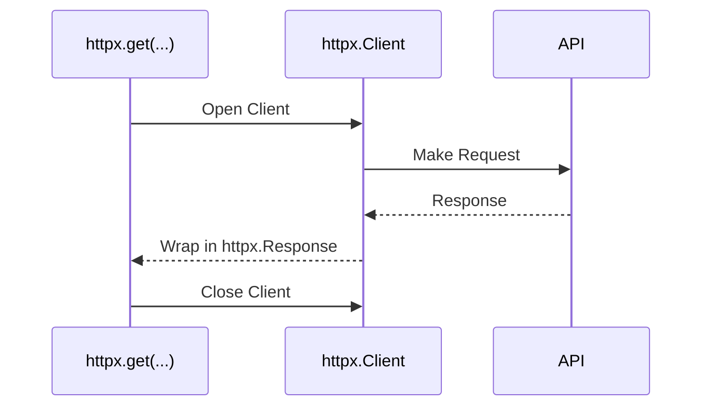

The base of Sensei HTTP requests is the [`httpx`](https://www.python-httpx.org) library.
When Sensei makes requests it uses`httpx.Client` (or `httpx.AsyncClient`) object.
You, too, might use these objects, and you don't suspect it. 

/// tip
If you don't know, why [`httpx`](https://www.python-httpx.org) is better than the `requests` library, you should read
[HTTP Requests/Introducing `httpx`](/learn/http_requests.html#introducing-httpx)
///

When you make a simple request, like the following:

```python
import httpx

response = httpx.get('https://example-api.com', params={'page': 1})
print(response.json())
```

`httpx` follows this algorithm: 



If you have used `requests`, it does the same. But `httpx.Client` corresponds to `requests.Session`.

??? note "Technical Details"
    Here is the implementation of the `get` function in `requests` and `httpx`.
                     
    === "httpx"
        Here most of the arguments are omitted and replaced with `...`
        ```python
        def request(
            method: str,
            url: URL | str,
            *,
            params: QueryParamTypes | None = None,
            headers: HeaderTypes | None = None,
            ...
        ) -> Response:
            with Client(...) as client:
                return client.request(
                    method=method,
                    url=url,
                    params=params,
                    headers=headers,
                    ...
                )
        
    
        def get(
            url: URL | str,
            *,
            params: QueryParamTypes | None = None,
            headers: HeaderTypes | None = None,
            ...
        ) -> Response:
            return request(
                "GET",
                url,
                params=params,
                headers=headers,
                ...
            )
        ```
    
    === "requests"
        ```python
        def request(method, url, **kwargs):
            with sessions.Session() as session:
                return session.request(method=method, url=url, **kwargs)
    
        def get(url, params=None, **kwargs):
            return request("get", url, params=params, **kwargs)
        ```

If you make dozens of requests, like this code:

```python
import httpx

urls = [...]
params_list = [{...}, ...]

for url, params in zip(urls, params_list):
    response = httpx.get(url, params=params)
    print(response.json())
```

`httpx` will open the client for each request. It slows your application. The better
solution is to use a single client instance. You can close it whenever you want.
   
```python
import httpx

urls = [...]
params_list = [{...}, ...]

with httpx.Client() as client:
    for url, params in zip(urls, params_list):
        response = client.get(url, params=params)
        print(response.json())
```

In the example above `httpx.Client` is closed after the last statement inside `with` block. You can close it
manually, calling the `close` method.

```python
import httpx

urls = [...]
params_list = [{...}, ...]

client = httpx.Client() 

for url, params in zip(urls, params_list):
    response = client.get(url, params=params)
    print(response.json())
    
client.close()
```

Furthermore, a client can be used for advanced request configuration. You can read 
[the article](https://www.python-httpx.org/advanced/clients/) from the [`httpx`](https://www.python-httpx.org) 
documentation, to learn more about `httpx.Client`.

When you call routed functions, Sensei makes the same: Open client → Make request → Close client.
How you can use your client so that you will close whenever you want? Let's introduce `Manager`

## Manager

`Manager` serves as a bridge between the application and Sensei, to dynamically provide a client for routed function calls.
It separately stores `httpx.AsyncClient` and `httpx.Client`.
To use `Manager` you need to create it and pass it to the router.
              
!!! example
    ```python
    from sensei import Manager, Router, Client
    
    manager = Manager()
    router = Router('httpx://example-api.com', manager=manager)
    
    @router.get('/users/{id_}')
    def get_user(id_: int) -> User:
        pass
    
    with Client(base_url=router.base_url) as client:
        manager.set(client)
        user = get_user(1)
        print(user)
        manager.pop()
    ```

You can import `httpx.Client` from `sensei` or `httpx`. They are the same classes.

=== "sensei"
    ```python
    from sensei import Client
    ```

=== "httpx"
    ```python
    from httpx import Client
    ```

Let's explore common actions.

### Setting 

You must know, that `Manager` can store only one instance of a client of each type (one `httpx.AsyncClient` and one `httpx.Client`)

There are two ways to set client.

=== "At creation"
    ```python
    from sensei import Manager, Router, Client, AsyncClient
    
    base_url = 'httpx://example-api.com'
    client = Client(base_url=base_url)
    aclient = AsyncClient(base_url=base_url)
    
    manager = Manager(sync_client=client, async_client=aclient)
    router = Router(base_url, manager=manager)
    ```

=== "Delayed"
    ```python
    from sensei import Manager, Router, Client, AsyncClient
    
    manager = Manager()
    router = Router('httpx://example-api.com', manager=manager)
    
    client = Client(base_url=router.base_url)
    aclient = AsyncClient(base_url=router.base_url)
    
    manager.set(client)
    manager.set(aclient)
    ```

/// warning
Client's base URL and router's base URL must be equal
      
??? failure "ValueError"
    ```python
    from sensei import Client, Manager, Router
    
    client = Client(base_url='https://order-api.com')
    manager = Manager(client)
    
    router = Router(host='https://user-api.com', manager=manager)
    
    @router.get('/users/{id_}')
    def get_user(id_: int) -> User:
        pass

    print(get_user(1))
    ```
    ValueError: Client base url must be equal to Router base url
///

### Retrieving

There are two ways to retrieve a client.

=== "Get"
    This returns a client without removing it from `Manager`. If `required=True` (default is `True`) in the `Manager` constructor, the error 
    will be thrown if the client is not set.  

    ```python
    manager = Manager()

    manager = Manager(sync_client=client, async_client=aclient)
    client = manager.get(is_async=False)
    aclient = manager.get(is_async=True)
    print(client, aclient)
    ```

=== "Pop"
    This return client and removes it from `Manager`

    ```python
    manager = Manager()

    manager = Manager(sync_client=client, async_client=aclient)
    client = manager.pop(is_async=False)
    aclient = manager.pop(is_async=True)
    print(client, aclient)
    ```


### Is empty

You can check whether a client is empty:

```python
manager = Manager()

manager = Manager(sync_client=client)
manager.pop()
print(manager.empty()) # Output: True
```

## Rate Limiting

Many APIs enforce [rate limits](https://en.wikipedia.org/wiki/Rate_limiting) to control how frequently clients can make
requests. You can add automatic waiting between requests, based on the period and the maximum number of requests allowed per this
period. This is achieved through a `RateLimit` instance 
            
This code is equivalent to **5 requests per second**.

```python
from sensei import RateLimit, Router

calls, period = 5, 1
rate_limit = RateLimit(calls, period)
router = Router('https://example-api.com', rate_limit=rate_limit)
```

The `RateLimit` class implements a token bucket rate-limiting system.  Tokens are added at a fixed rate, and each request uses one token. 
If tokens run out, Sensei waits until new tokens are available, preventing rate-limit violations. 
If a token was consumed, the new one will appear in `period / calls` seconds. That is **5 requests per second** is equivalent
**1 token per 1/5 seconds**.
                  
In the following example, the code will be paused for 1 second after each request:

```python
from sensei import RateLimit, Router

calls, period = 1, 1
rate_limit = RateLimit(calls, period)
router = Router('https://example-api.com', rate_limit=rate_limit)

@router.get('/users/{id_}')
def get_user(id_: int) -> User:
    pass

for i in range(5):
    get_user(i)  # (1)!
```

1. Here code will be paused for 1 second after each iteration
                                                 
If you want to use another rate-limiting system, you can implement the `IRateLimit` interface and use it like before.
Namely, you need to implement the following two methods.

```python
from sensei.types import IRateLimit

class CustomLimit(IRateLimit):    
    async def async_wait_for_slot(self) -> None:
        ...
    
    def wait_for_slot(self) -> None:
        ...
```

## Setting Port

If you connect to some local API, that allows configuring port, you can make a dynamic URL with `{port}` placeholder.
In addition, you can change `port` attribute in `Router`. 
Here is an example:

```python
from sensei import Router

router = Router(host='https://local-api.com:{port}/api/v2', port=3000)
print(router.base_url) # Output: https://local-api.com:3000/api/v2

router.port = 4000
print(router.base_url) # Output: https://local-api.com:4000/api/v2
```

If `{port}` placeholder is not provided, the port will be appended to the end of the URL

```python                                    
from sensei import Router

router = Router(host='https://local-api.com', port=3000)
print(router.base_url) # Output: https://local-api.com:3000
```
                          
## Recap

Here’s a recap of working with `httpx` clients for efficient HTTP request management:

### Sensei’s `Manager` and Routing System
- The `Manager` provides a single client for multiple requests, managing both `httpx.Client` and `httpx.AsyncClient` instances.
- `Manager` can store one synchronous and one asynchronous client, ensuring only one of each type is available at any time.
- To link the `Manager` to requests, create a `Router` instance that defines a base URL for all endpoints.

### Managing Clients with `Manager`
- **Setting Clients**: Assign clients to the `Manager` when created or later with `.set()`.
- **Retrieving Clients**: Use `.get()` to access clients without removal or `.pop()` to retrieve and remove the client from `Manager`.
- **Checking Clients**: Use `.empty()` to check if there are no clients in `Manager`.

### Rate Limiting with `RateLimit`
- APIs often have rate limits, and `Sensei` includes a `RateLimit` class to enforce these.
- Set calls per second or minute to prevent exceeding rate limits.
- Implement custom rate-limiting by subclassing `IRateLimit`.

### Configuring Ports Dynamically
- Specify a `{port}` placeholder in the base URL to dynamically adjust the API port as needed with `Router`.

By efficiently managing HTTP clients and rate limits, `Sensei` optimizes API interactions, reducing latency and improving performance.