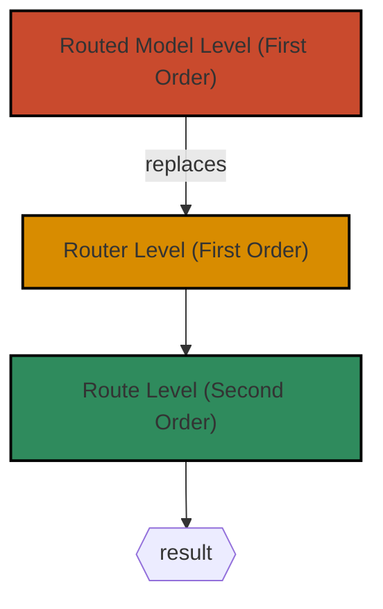

from sensei import APIModelWhen you need to handle response in a nonstandard way or add or change arguments 
before request, you can apply preparers and finalizers respectively. Before the start, we need to remember about 
[Hook Levels](/learn/user_guide/making_aliases.html#hook-levels-priority).

## Hook Levels (Order)

As was mentioned in [Hook Levels](/learn/user_guide/making_aliases.html#hook-levels-priority), there are three 
ways of applying converters:

!!! example
    === "Router Level"
        ```python
        from sensei import Router, camel_case, snake_case
        
        router = Router(
            'https://api.example.com',
            body_case=camel_case,
            response_case=snake_case
        )
        
        @router.post('/users')
        def create_user(first_name: str, birth_city: str, ...) -> User: 
            ...
        ```

    === "Route Level"
        ```python
        from sensei import Router, kebab_case, camel_case
        
        router = Router(
            'https://api.example.com',
            body_case=kebab_case
        )
            
        @router.post('/users', body_case=camel_case)
        def create_user(first_name: str, birth_city: str, ...) -> User: 
            ...
        ```

    === "Routed Model Level"
    
        ```python
        router = Router(host, response_case=camel_case)

        class User(APIModel):
            def __header_case__(self, s: str) -> str:
                return kebab_case(s)
        
            @staticmethod
            def __response_case__(s: str) -> str:
                return snake_case(s)
        
            @classmethod
            @router.get('/users/{id_}')
            def get(cls, id_: Annotated[int, Path(alias='id')]) -> Self: ...
        ```

These levels are not only related to [case converters](/learn/user_guide/making_aliases.html#case-converters). 
They are also related to other hooks, such as [Preparers](#preparers) and [Finalizers](#finalizers). 

But here they don't determine the single Preparer/Finalizer from all that will be executed (determine priority), 
like for case converters. Each of them will be executed, but in different order. So, this type of hook levels is 
called **Order Levels**. 

Here is an illustration of execution orders of Preparers/Finalizers. 
  


## Preparers
Preparer is a function that takes instance of `Args` as argument and returns the modified. 
Preparers are used for request preparation. That means add or change arguments 
before request. 
    
Preparers are executed after internal argument parsing. So, all request parameters are available in
`Args` model within a preparer.

### Algorithm

Look at the example below:
      
=== "Route Level"
    ```python
    from sensei import Args, Router, APIModel
    from pydantic import NonNegativeInt, EmailStr
    
    router = Router('https://api.example.com')
    
    class User(APIModel):
        id: NonNegativeInt
        email: EmailStr
        nickname: str
    
    @router.get('/users/{id_}')
    def get_user(id_: int) -> User:
        ...
    
    @get_user.prepare
    def _get_user_in(args: Args) -> Args:
        print(f'Preparing arguments for {args.url} request')
        return args
    
    user = get_user(1)
    print(user)
    ```

=== "Router Level"
    ```python
    from sensei import Args, Router, APIModel
    from pydantic import NonNegativeInt, EmailStr
    
    def _prepare_args(args: Args) -> Args:
        print(f'Preparing arguments for {args.url} request')
        return args
    
    router = Router('https://api.example.com', __prepare_args__=_prepare_args)
    
    class User(APIModel):
        id: NonNegativeInt
        email: EmailStr
        nickname: str
    
    @router.get('/users/{id_}')
    def get_user(id_: int) -> User:
        ...
    
    user = get_user(1)
    print(user)
    ```

=== "Routed Model Level"
    ```python
    from sensei import Args, Router, APIModel
    from pydantic import NonNegativeInt, EmailStr
    
    router = Router('https://api.example.com')
              
    class User(APIModel):
        id: NonNegativeInt
        email: EmailStr
        nickname: str
        
        @staticmethod
        def __prepare_args__(args: Args) -> Args:
            print(f'Preparing arguments for {args.url} request')
            return args
    
        @classmethod
        @router.get('/users/{id_}')
        def get(cls, id_: int) -> "User":
            ...
    
    user = User.get(1)
    print(user)
    ```

```text
Preparing arguments for /users/1 request
User(id=1, email="john@example.com", nickname="john")
```

Let's take this code step by step.

#### Step 1: Define Route

First, we need to define a route(s)
       
=== "Route Level"
    ```python
    @router.get('/users/{id_}')
    def get_user(id_: int) -> User:
        ...
    ```

=== "Router Level"
    ```python
    @router.get('/users/{id_}')
    def get_user(id_: int) -> User:
        ...
    ```

=== "Routed Model Level"
    ```python
    @classmethod
    @router.get('/users/{id_}')
    def get(cls, id_: int) -> "User":
        ...
    ```
   
#### Step 2: Define Preparer

To define a preparer, you have to create a function, that takes only one argument of `Args` type and returns
a value of the same type. The next step is based on a level type:
         
=== "Route Level"
    Decorate it as `@<routed_function>.prepare`
    ```python
    @get_user.prepare
    def _get_user_in(args: Args) -> Args:
        print(f'Preparing arguments for {args.url} request')
        return args
    ```

=== "Router Level"
    Pass function to `Router` object
    ```python
    def _prepare_args(args: Args) -> Args:
        print(f'Preparing arguments for {args.url} request')
        return args

    router = Router('https://api.example.com', __prepare_args__=_prepare_args)
    ```

=== "Routed Model Level"
    You only need to define a class or static method with name `__prepare_args__` inside `User`. Sensei will use this 
    hook, when it's necessary.
    ```python
    class User:
        ...
        
        @staticmethod
        def __prepare_args__(args: Args) -> Args:
            print(f'Preparing arguments for {args.url} request')
            return args
    ```

#### Step 3: Make Call

When you make the following call 
        
=== "Route Level"
    ```python
    user = get_user(1)
    print(user)
    ```

=== "Router Level"
    ```python
    user = get_user(1)
    print(user)
    ```

=== "Routed Model Level"
    ```python
    user = User.get(1)
    print(user)
    ```

Sensei collects function's arguments, transforms it to `Args` instance and calls preparer if it's defined.

```text
Preparing arguments for /users/1 request
```

After Sensei uses prepared arguments for request and makes it.

```text
User(id=1, email="john@example.com", nickname="john")
```

### Usage

There are few examples of using preparers at different levels.

#### Route (Routed Method)

You can use preparers when some request parameter should be retrieved as the attribute of 
a [Routed Model](/learn/user_guide/routed_model.html) object from which the method was called 
              
```python
from sensei import APIModel, format_str, Router, Args
from pydantic import NonNegativeInt, EmailStr

router = Router('https://api.example.com')

class User(APIModel):
    id: NonNegativeInt
    email: EmailStr
    nickname: str
    
    @router.patch('/users/{id_}')
    def update(
            self,
            name: str,
            job: str
    ) -> None:
        ...
    
    @update.prepare
    def _update_in(self, args: Args) -> Args:
        args.url = format_str(args.url, {'id_': self.id})
        return args
```

/// info
Don't confuse route level (as routed method level) with routed model level.
The example above is route level, not routed model level.
///
    
#### Router/Routed Model

You can use preparers when all requests require a set of the same parameters, like 
`Authorization` header. These preparers are executed for each routed function, related to the router
that preparer is associated with.

##### Router

To apply preparer at router level, you need to use argument `__prepare_args__` of `Router` constructor.

```python
from sensei import APIModel, Router, Args
from pydantic import NonNegativeInt, EmailStr


class User(APIModel):
    id: NonNegativeInt
    email: EmailStr
    nickname: str


class Context:
    token: str


def prepare_args(args: Args) -> Args:
    args.headers['Authorization'] = f'Bearer {Context.token}' # (1)!
    return args


router = Router('https://api.example.com', __prepare_args__=prepare_args)

@router.patch('/users/{id_}')
def update_user(id_: int, nickname: str) -> None:
    ...

@router.post('/users')
def create_user(email: EmailStr, nickname: str) -> User:
    ...

Context.token = 'secret_token'
id_ = create_user('john@example.com', 'john').id
update_user(id_, 'john_good')
```

1. **Context** class is used for dynamic retrieving of auth token 

`Authorization` header will be added to `create_user(...)` and `update_user(...)` requests. 

##### Routed Model
                   
To apply preparer at routed model level, you need to use hook `__prepare_args__`. 

```python
from sensei import APIModel, Router, Args, format_str
from pydantic import NonNegativeInt, EmailStr

router = Router('https://api.example.com')

class Context:
    token: str

class User(APIModel):
    id: NonNegativeInt
    email: EmailStr
    nickname: str

    @staticmethod
    def __prepare_args__(args: Args) -> Args:
        args.headers['Authorization'] = f'Bearer {Context.token}' # (1)!
        return args

    @router.patch('/users/{id_}')
    def update(self, nickname: str) -> None:
        ...
    
    @update.prepare
    def _update_in(self, args: Args) -> Args:
        args.url = format_str(args.url, {'id_': self.id})
        return args
    
    @classmethod
    @router.post('/users')
    def create(cls, email: EmailStr, nickname: str) -> "User":
        ...

Context.token = 'secret_token'
user = User.create('john@example.com', 'john')
user.update('john_good')
```

1. **Context** class is used for dynamic retrieving of auth token

In the example above, there are two preparers of different levels.

=== "Routed Model Level"
    ```python 
    @staticmethod
    def __prepare_args__(args: Args) -> Args:
        args.headers['Authorization'] = f'Bearer {Context.token}' 
        return args
    ```     

=== "Route Level"
    ```python 
    @update.prepare
    def _update_in(self, args: Args) -> Args:
        args.url = format_str(args.url, {'id_': self.id})
        return args
    ```        
  
According to [Order Levels](#hook-levels-order), preparer at routed model level (`__prepare_args__`) is executed before 
route level preparer (`_update_in` ).

/// tip 
If some Router/Routed Model level preparer should be excluded for some route, you can use `skip_preparer=True` in route 
decorator

```python
class User(APIModel):
    ...

    @router.get('/users/{id_}', skip_preparer=True)
    def get(self, id_: int) -> "User":
        ...
```

But this doesn't exclude route level preparers, like that:

```python
@get.preparer()
def _get_in(self, args: Args) -> Args:
    return args
```
///
  
## Finalizers

There are two types of finalizers: [Response Finalizer](#response-finalizer) and [JSON Finalizer](#json-finalizer).
Let's explore them:
                     
### Response Finalizer

Response Finalizer is a function that takes instance of `httpx.Response` as argument and returns the result of calling 
routed function (method). Return value must be of the same type with routed function (method).

Response Finalizers are used for response transformation, that can't be performed automatically, if set a corresponding response 
type from the category of automatically handled.
                     
/// info
Response Finalizers can be defined only at route level. 
///     

If [response type](/learn/user_guide/params_response.html#response-types) is not from category automatically handled, you have to define response finalizer.
Otherwise, error will be thrown.

#### Algorithm

Look at the example below:

```python
from sensei import Router, APIModel, Body
from pydantic import EmailStr
from typing import Annotated
from httpx import Response

router = Router('https://api.example.com')

class UserCredentials(APIModel):
    email: EmailStr
    password: str

@router.post('/register')
def sign_up(
        user: Annotated[UserCredentials, Body(
            embed=False, 
            media_type='application/x-www-form-urlencoded'
        )]
) -> str:
    ...

@sign_up.finalize
def _sign_up_out(response: Response) -> str:
    print(f'Finalizing response for request {response.request.url}')
    return response.json()['token']


token = sign_up(UserCredentials(
    email='john@example.com', 
    password='secret_password')
)
print(f'JWT token: {token}')
```

```text
Finalizing response for request /register
JWT token: eyJhbGciOiJIUzI1NiIsInR5cCI6IkpXVCJ9.eyJzdW...
```

Let's take this code step by step.
       
##### Step 1: Define Route

First, we need to define a route

```python
@router.post('/register')
def sign_up(
        user: Annotated[UserCredentials, Body(
            embed=False, 
            media_type='application/x-www-form-urlencoded'
        )]
) -> str:
    ...
```
   
##### Step 2: Define Finalizer

To define a response finalizer, you have to create a function, that takes only one argument of `httpx.Response` type and returns
a value of the same type as the routed function. After that, decorate it as `@<routed_function>.finalize`.

```python
@sign_up.finalize
def _sign_up_out(response: Response) -> str:
    print(f'Finalizing response for request {response.request.url}')
    return response.json()['token']
```

##### Step 3: Make Call

When you make the following call 

```python
token = sign_up(UserCredentials(
    email='john@example.com', 
    password='secret_password')
)
print(f'JWT token: {token}')
```

Sensei makes a request, retrieves the response and pass `Response` object to finalizer, if it's defined.

```text
Finalizing response for request /register
```

Finally, the routed function returns the result of the finalizer call.  In this example the result is JWT token.

```text
JWT token: eyJhbGciOiJIUzI1NiIsInR5cCI6IkpXVCJ9.eyJzdW...
```

#### Usage
Response Finalizers are used for response transformation, that can't be performed automatically, 
if set a corresponding response type from the category of automatically handled.
                                                
??? example
    This example was shown in [Algorithm](#algorithm_1)

    ```python
    from sensei import Router, APIModel, Body
    from pydantic import EmailStr
    from typing import Annotated
    from httpx import Response
    
    router = Router('https://api.example.com')
    
    class UserCredentials(APIModel):
        email: EmailStr
        password: str
    
    @router.post('/register')
    def sign_up(
            user: Annotated[UserCredentials, Body(
                embed=False, 
                media_type='application/x-www-form-urlencoded'
            )]
    ) -> str:
        ...
    
    @sign_up.finalize
    def _sign_up_out(response: Response) -> str:
        print(f'Finalizing response for request {response.request.url}')
        return response.json()['token']
    
    
    token = sign_up(UserCredentials(
        email='john@example.com', 
        password='secret_password')
    )
    print(f'JWT token: {token}')
    ```

### JSON Finalizer

JSON Finalizer is a function that takes decoded JSON response, as argument and returns the modified JSON. 
These finalizers are used for JSON response transformation before internal or user-defined response finalizing.
     
/// info
JSON Finalizers can be defined only at router/routed model level. 
///
        
#### Algorithm

For instance, each response wraps primary data in a field "data"

Like that API response:

```http
HTTP/1.1 200 OK
Content-Type: application/json

{
  "status": "success",
  "data": {
      "id": 123,
      "name": "Alice",
      "email": "alice@example.com"
  }
}
```

To automatically handle the response, you either need to define this model

```python
class _UserData(APIModel):
    id: int
    name: str
    email: EmailStr

class User(APIModel):
    data: _UserData
```

Which is inconvenient to use, or define the next [response finalizer](#response-finalizer)

```python
class User(APIModel):
    id: int
    name: str
    email: EmailStr
    
@router.get('/users/{id_}')
def get_user(id_: Annotated[int, Path(alias='id')]) -> User: 
    ...

@get_user.finalize
def _user_out(response: Response) -> User:
    return User(**response.json()['data'])
```

The approach with response finalizer returns a better model than the approach with
wrapping model in another model. 

But there is a problem, what if you have dozens of similar functions and for each you have to
define the same finalizer? JSON finalizer is the solution of this problem.

Let's try to figure out the algorithm to the situation described above:

=== "Router Level"
    ```python
    from sensei import Router, APIModel, Query, Path
    from typing import Any, Annotated
    from pydantic import EmailStr, PositiveInt, AnyHttpUrl
    
    def _finalize_json(json: dict[str, Any]) -> dict[str, Any]:
        return json['data']
    
    router = Router('https://api.example.com', __finalize_json__=_finalize_json)
    
    class User(APIModel):
        email: EmailStr
        id: PositiveInt
        name: str
    
    @router.get('/users')
    def query_users(
            page: Annotated[int, Query()] = 1,
            per_page: Annotated[int, Query(le=7)] = 3
    ) -> list[User]:
        ...
    
    @router.get('/users/{id_}')
    def get_user(id_: Annotated[int, Path(alias='id')]) -> User: 
        ...

    user = get_user(1)
    print(user)
    ```

=== "Routed Model Level"
    ```python
    from sensei import Router, APIModel, Query, Path
    from typing import Any, Annotated
    from typing_extensions import Self
    from pydantic import EmailStr, PositiveInt, AnyHttpUrl
    
    router = Router('https://api.example.com')
    
    class User(APIModel):
        email: EmailStr
        id: PositiveInt
        name: str
                    
        @classmethod
        def __finalize_json__(cls, json: dict[str, Any]) -> dict[str, Any]:
            return json['data']
    
        @classmethod
        @router.get('/users')
        def query(
                cls,
                page: Annotated[int, Query()] = 1,
                per_page: Annotated[int, Query(le=7)] = 3
        ) -> list[Self]:
            ...
    
        @classmethod
        @router.get('/users/{id_}')
        def get(cls, id_: Annotated[int, Path(alias='id')]) -> Self: 
            ...

    user = User.get(1)
    print(user)
    ```

```text
User(email='john@example.com' id=1 name='John')
```

Let's take this code step by step.
        
##### Step 1: Define Route

First, we need to define a route(s)
       
=== "Router Level"
    ```python
    @router.get('/users')
    def query_users(
            page: Annotated[int, Query()] = 1,
            per_page: Annotated[int, Query(le=7)] = 3
    ) -> list[User]:
        ...
    
    @router.get('/users/{id_}')
    def get_user(id_: Annotated[int, Path(alias='id')]) -> User: 
        ...
    ```

=== "Routed Model Level"
    ```python
    @classmethod
    @router.get('/users')
    def query(
            cls,
            page: Annotated[int, Query()] = 1,
            per_page: Annotated[int, Query(le=7)] = 3
    ) -> list[Self]:
        ...

    @classmethod
    @router.get('/users/{id_}')
    def get(cls, id_: Annotated[int, Path(alias='id')]) -> Self: 
        ...
    ```

##### Step 2: Define Finalizer

To define a JSON finalizer, you have to create a function, that takes only one argument of some JSON-serializable type
corresponding to the response. Usually servers return JSON as `dict[str, Any]`, but rarely can return `list[dict]`.
The next step is based on a level type:
            
=== "Router Level"
    Pass function to `Router` object
    ```python
    def _finalize_json(json: dict[str, Any]) -> dict[str, Any]:
        return json['data']
        
    router = Router('https://api.example.com', __finalize_json__=_finalize_json)
    ```

=== "Routed Model Level"
     You only need to define a class or static method with name `__finalize_json__` inside `User`. Sensei will use this hook, when it's necessary.
    ```python
    @classmethod
    def __finalize_json__(cls, json: dict[str, Any]) -> dict[str, Any]:
        return json['data']
    ```

##### Step 3: Make the call

When you make the following call
          
=== "Router Level"
    ```python
    user = get_user(1)
    print(user)
    ```

=== "Routed Model Level"
    ```python
    user = User.get(1)
    print(user)
    ```

Sensei makes a request, retrieves the response, decodes it as JSON and pass it to response finalizer if it's defined.

```text
User(email='john@example.com' id=1 name='John')
```

That is, JSON finalizer is executed before response finalizer. Due to this, `Self` response type can be handled
without a response finalizer.

#### Usage

JSON finalizers are used for JSON response transformation before internal or user-defined response finalizing. 
The example was shown in [Algorithm](#algorithm_2)

!!! tip
    If some Router/Routed Model level finalizer should be excluded for some route, you can use `skil_finalizer=True` in route 

    ```python
    
    class User(APIModel):
        ...
    
        @classmethod
        @router.get('/users/{id_}', skip_finalizer=True)
        def get(cls, id_: Annotated[int, Path(alias='id')]) -> Self: 
            ...
    ```

## Async 

Preparers/Finalizers can be async, if associated routed function is also async.

```python
class User(APIModel):
    ...

    @router.patch('/users/{id_}')
    async def update(
            name: str,
            job: str
    ) -> datetime.datetime:
        ...
    
    @update.prepare
    async def _update_in(self, args: Args) -> Args:
        args.url = format_str(args.url, {'id_': self.id})
        await asyncio.sleep(1.5)
        return args
    
    @update.finalize
    async def _update_out(self, response: Response) -> datetime.datetime:
        json_ = response.json()
        result = datetime.datetime.strptime(json_['updated_at'], "%Y-%m-%dT%H:%M:%S.%fZ")
        await asyncio.sleep(1.5)
        self.first_name = json_['name']
        return result
```

## Recap

In summary, Sensei provides flexible hooks to customize how requests are prepared and responses are handled through 
[Preparers](#preparers) and [Finalizers](#finalizers). These hooks can be applied at different levels with an organized execution order, 
providing nuanced control over request handling and response processing:

- **Hook Levels**
   
    Sensei defines three levels for hooks:

    1. Routed Model Level (executed first) - Define within the routed model, to use across routed methods
    2. Router Level (executed next) - Attach to a `Router` instance to use across routes
    3. Route Level (executed last) - Directly to a specific route 

    Each of these levels allows you to add preparers or finalizers that operate at different scopes, 
    with Routed Model Level being the most specific and executed first.

- **Preparers**

    Preparers are used to modify or add arguments before a request is sent. 

    Example:
    Preparers are commonly used to add authentication headers, or to dynamically set route parameters (e.g., filling in 
    path variables from the instance attributes).

- **Finalizers**

    Finalizers process responses after a request. They come in two forms:

    1. Response Finalizer: Operates on the `httpx.Response` object, transforming it into the final returned data.
    2. JSON Finalizer: Works on JSON data from the response, modifying it before other processing. JSON finalizers are 
        helpful for removing unnecessary nested structures or normalizing data formats.

    Example:
    If an API response wraps data in an additional "data" field, a JSON finalizer can remove this wrapper automatically 
    for all routes associated with the router or routed model. The Response Finalizer can then transform the processed 
    JSON into the model or data structure defined in the route.
