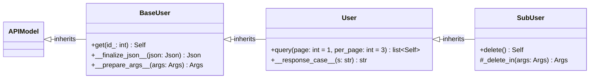

/// tip
If you don't know what are `Self`, `list[Self]` response types and 
[Forward Reference](/learn/user_guide/params_response.html#forward-reference), you should read 
[Params/Response](/learn/user_guide/params_response.html).
///

**Routed Model** is the OOP style of making Sensei models when a model performs both validation and making requests.
To use this style, you need to implement a model derived from `APIModel` and add inside routed methods.
                                       
```python
from typing import Annotated
from typing_extensions import Self
from sensei import APIModel, Router, Path
from pydantic import NonNegativeInt, EmailStr

router = Router('https://api.example.com/')

class User(APIModel):
    id: NonNegativeInt
    username: str
    email: EmailStr
    
    @classmethod
    @router.get('/users/{id_}')
    def get(cls, id_: Annotated[NonNegativeInt, Path()]) -> Self: 
        pass # (1)!
```

1. This is called [routed method](/learn/user_guide/first_steps.html#routed-function)

As was mentioned before, you apply can the same techniques as for `pydantic.BaseModel`. These key principles were 
described in [First Steps/API Model](/learn/user_guide/first_steps.html#api-model).

/// warning
You must not decorate a method as routed in a class not inherited from `APIModel`.
This makes it impossible to use [Preparers/Finalizers](/learn/user_guide/preparers_finalizers.html) and 
[Class Hooks](#class-hooks)

For instance, there is a common error to use `BaseModel` for the same purpose as `APIModel`:

```python
from pydantic import BaseModel
from typing import Annotated
from typing_extensions import Self
from sensei import Router, Path
from pydantic import NonNegativeInt, EmailStr

router = Router('https://api.example.com/')

class User(BaseModel):
    id: NonNegativeInt
    username: str
    email: EmailStr
    
    @classmethod
    @router.get('/users/{id_}')
    def get(cls, id_: Annotated[NonNegativeInt, Path()]) -> Self: 
        pass 
```
///

## Class Hooks
"Apply class hook" means the same as "apply hook at routed model level." Hook names are the same as
the names of Python dunder methods (short for "double underscore"). That is, the name starts with "\_\_" and ends with "\_\_".
In other words, hooks are called by pattern `<__hook_name__>`.

??? info "Dunder methods"
    Dunder methods (short for "double underscore") are special methods in Python that start and end with double 
    underscores, like `__init__`, `__str__`, `__add__`, etc. These methods are also known as "magic methods" and 
    enable Python classes to implement specific behaviors by defining certain functionalities that get triggered under 
    particular conditions.

    Some common dunder methods include:

    - `__init__(self, ...)`: The initializer or constructor, which runs when a new instance of a class is created.
    - `__str__(self)`: Called by `str()` and `print()` to provide a human-readable string representation of the object.
    - `__repr__(self)`: Called by `repr()` and used to provide a developer-friendly string representation, often useful for debugging.
    - `__add__(self, other)`: Defines behavior for the `+` operator.
    - `__len__(self)`: Allows the use of `len()` on an instance of the class.
    - `__getitem__(self, key)`: Allows indexing, like `obj[key]`.
    - `__call__(self, ...)`: Allows an instance to be called as a function, using parentheses `()`.
    - `__eq__(self, other)`: Defines behavior for the equality operator `==`.

    Dunder methods allow you to customize the behavior of instances, often making them behave like built-in types in Python. 
    For example, by implementing `__add__`, you can enable the `+` operator to add two instances of a class in a custom way.
                   
To define some hook, you need to create a method `<__hook_name__>` inside the model.
These methods can be represented as a `@classmethod` or a `@staticmethod`, but not an instance method.

!!! failure "ValueError"
    ```python
    class User(APIModel):
        email: EmailStr
        id: int
        first_name: str
        last_name: str
        avatar: HTTPUrl
    
        def __finalize_json__(self, json: Json) -> Json:
            print(super().__finalize_json__)
            return json['data']
        
        ...
    ```

    ValueError: Class hook \_\_finalize_json\_\_ cannot be instance method

### Case Converters
As we know, there are some parameter types, such as query, path, body, header, and cookie.
Each `<param_type>` corresponds to `__<param_type>_case__` hook. Let's look at the example below:

```python
router = Router(host, response_case=camel_case)

class User(APIModel):
    email: EmailStr
    id: int
    first_name: str
    last_name: str
    avatar: HTTPUrl

    @classmethod
    def __header_case__(cls, s: str) -> str:
        return kebab_case(s)

    @staticmethod
    def __response_case__(s: str) -> str:
        return snake_case(s)

    @classmethod
    @router.get('/users/{id_}')
    def get(cls, id_: Annotated[int, Path(alias='id')]) -> Self: 
        pass
```

As was mentioned before, a hook function can be represented both as a class method and as a static method, but not instance methods.
   
/// tip
If you don't know why the `response_case=camel_case` statement in the `Router` constructor is ignored here, you should
read about [Priority Levels](/learn/user_guide/making_aliases.html#hook-levels-priority)             
///

### Preparers/Finalizers

JSON Finalizer corresponds to hook `__finalize_json__`
 
```python
class User(APIModel):
    email: EmailStr
    id: int
    first_name: str
    last_name: str
    avatar: HTTPUrl

    @classmethod
    def __finalize_json__(cls, json: Json) -> Json:
        print(super().__finalize_json__)
        return json['data']
    
    ...
```
     
Preparer (routed model level) corresponds to hook `__prepare_args__`

```python
class User(APIModel):
    email: EmailStr
    id: int
    first_name: str
    last_name: str
    avatar: HTTPUrl

    @staticmethod
    def __prepare_args__(cls, args: Args) -> Args:
        args.headers['X-Token'] = 'secret_token'
        return args
    
    ...
```

## Self/list[Self]
 
If you don't know about [`Self`](/learn/user_guide/params_response.html#self) and 
[`list[Self]`](/learn/user_guide/params_response.html#listself) response types you should read 
[Params/Response](/learn/user_guide/params_response.html).

## Naming conventions 

Response finalizers and route level preparers usually have protected/private access modifier, because they are not intended
to use directly.

??? info "Access Modifiers"
    In programming, access modifiers control the visibility and accessibility of class members (attributes and methods) from outside the class. They determine how and where members can be accessed or modified.

    Python doesn’t have strict access modifiers like other languages (e.g., `public`, `protected`, `private` in C++ or Java), 
    but it uses naming conventions to mimic their behavior:
    
    1. **Public**: By default, all class members in Python are public. Public members can be accessed from anywhere—inside 
        or outside the class. Example:
       ```python
       class MyClass:
           def __init__(self):
               self.public_var = "I'm public"
       ```
       Here, `public_var` is accessible from outside the class instance.
    
       2. **Protected**: Python uses a single underscore prefix (`_`) to indicate that a member is protected and intended 
        for internal use within the class or its subclasses. Although it can still be accessed from outside, the 
        underscore suggests that it shouldn’t be. Example:
          ```python
          class MyClass:
              def __init__(self):
                  self._protected_var = "I'm protected"
          ```
    
       3. **Private**: To make a member private, Python uses a double underscore prefix (`__`). This triggers name 
        mangling, where the interpreter changes the name to `_ClassName__member`, making it harder (but still possible) 
        to access from outside. This is used to indicate that the member is intended for internal use only and 
        shouldn't be accessed directly. Example:
          ```python
          class MyClass:
              def __init__(self):
                  self.__private_var = "I'm private"
          ```
    
    In practice, these conventions help developers understand which parts of the code are meant for internal use and 
    which can be accessed or modified externally, but they don’t enforce strict restrictions.

     
In the following example preparer `_login_in` and response finalizer `_login_out` have protected access modifiers. 

```python
class User(APIModel):
    id: NonNegativeInt
    username: str
    email: EmailStr
    
    @router.post('/token')
    def login(self) -> str: pass

    @login.prepare
    def _login_in(self, args: Args) -> Args:
        args.json_['email'] = self.email
        return args

    @login.finalize
    def _login_out(self, response: Response) -> str:
        return response.json()['token']
```

In addition, the preparer should end with `in` and start with the routed function name, that is `_<routed_function>_in`.
And finalizer should end with `out` and start the same as the preparer, that is `_<routed_function>_out`.
       
## Inheritance

### Base Class
    
It is often necessary to implement models with the same methods. One way to avoid duplication in this case is inheritance. 

For example, you have different models that require the same authorization headers and return primary data in the "data" field.
In addition, each response must be converted to a snake_case.
The solution is to create a base class that implements `__finalize_json__`, `__prepare_args__`, and `__response_case__` and inherit
all models from it.

```python
from typing import Annotated
from pydantic import Field, HttpUrl
from sensei import Router, Path, APIModel, Json, Args, snake_case, Form, File

router = Router('https://reqres.in/api')


class Base(APIModel):
    @classmethod
    def __finalize_json__(cls, json: Json) -> Json:
        return json['data']

    @classmethod
    def __prepare_args__(cls, args: Args) -> Args:
        args.headers['X-Token'] = 'secret_token'
        return args

    @classmethod
    def __response_case__(cls, s: str) -> str:
        return snake_case(s)  


class User(Base):
    id: NonNegativeInt
    username: str
    email: EmailStr
    
    @classmethod
    @router.get('/users/{id_}')
    def get(cls, id_: Annotated[int, Path(alias='id')]) -> "User":
        pass


class Video(Base):
    url: HttpUrl
    tags: list[str]
    
    @classmethod
    @router.post('/publish')
    def publish(
            cls, 
            video: Annotated[bytes, File()], 
            tags: Annotated[list[str], Form(min_length=1)]
    ) -> "Video":
        pass
```

When you apply inheritance, you must know that inherited routed methods use hooks declared in the class hierarchy above,
but not below.
That means that if you write this code.

```python
from typing import Annotated
from typing_extensions import Self
from sensei import Router, Path, APIModel, Json, Args, snake_case, Query

router = Router('https://reqres.in/api')


class BaseUser(APIModel):
    @classmethod
    def __finalize_json__(cls, json: Json) -> Json:
        return json['data']

    @classmethod
    def __prepare_args__(cls, args: Args) -> Args:
        args.headers['X-Token'] = 'secret_token'
        return args

    @classmethod
    @router.get('/users/{id_}')
    def get(cls, id_: Annotated[int, Path(alias='id')]) -> Self:
        pass


class User(BaseUser):
    @classmethod
    def __response_case__(cls, s: str) -> str:
        return snake_case(s)

    @classmethod
    @router.get('/users')
    def query(
            cls,
            page: Annotated[int, Query()] = 1,
            per_page: Annotated[int, Query(le=7)] = 3
    ) -> list[Self]:
        pass


class SubUser(User):
    @router.delete('/users/{id_}')
    def delete(self) -> Self: 
        pass

    @delete.prepare
    def _delete_in(self, args: Args) -> Args:
        url = args.url
        url = format_str(url, {'id_': self.id})
        args.url = url
        return args
```

Hook `__response_case__` will not be applied to the `get` route. It will be applied to routes, declared in `User`, such as
`query` and in its subclasses, such as `delete`.

This can be explained in this diagram:



/// warning
You should prefer to use `Self` instead of [Forward References](/learn/user_guide/params_response.html#forward-reference).
This is related to inheritance. If you make a subclass of a class, having [Forward Reference](/learn/user_guide/params_response.html#forward-reference)
as the type hint, the subclass will try to return superclass and encounter the error. 

Setting `Self` resolves the issue, because this response type allows to dynamically retrieve the current class. 
         
=== "ValueError"
    !!! failure "ValueError"
        ```python
        class BaseUser(APIModel):
            ...
        
            @classmethod
            @router.get('/users/{id_}')
            def get(cls, id_: Annotated[int, Path(alias='id')]) -> "BaseUser":
                pass
        
        
        class User(BaseUser):
            ...
        
            @classmethod
            @router.get('/users')
            def query(
                    cls,
                    page: Annotated[int, Query()] = 1,
                    per_page: Annotated[int, Query(le=7)] = 3
            ) -> list["User"]:
                pass
        
        user = User.get(1)
        print(user)
        ```
        ValueError: Response finalizer must be set, if response is not from: (type[pydantic.main.BaseModel], <class 'str'\>, 
            <class 'dict'\>, <class 'bytes'\>, list[dict], <class 'pydantic.main.BaseModel'\>, list[pydantic.main.BaseModel])

=== "Success"
    !!! success 
        ```python
        class BaseUser(APIModel):
            ...
        
            @classmethod
            @router.get('/users/{id_}')
            def get(cls, id_: Annotated[int, Path(alias='id')]) -> Self:
                pass
        
        
        class User(BaseUser):
            ...
        
            @classmethod
            @router.get('/users')
            def query(
                    cls,
                    page: Annotated[int, Query()] = 1,
                    per_page: Annotated[int, Query(le=7)] = 3
            ) -> list[Self]:
                pass
        
        user = User.get(1)
        print(user)
        ```    
///

### Async/Sync

Often you want to implement both synchronized and asynchronous versions of the code. 
Inheritance from an abstract class is a good choice.

??? info "Abstract Class"
    The `ABC` class in Python, from the `abc` module, is used to define **abstract base classes**. 
    An abstract base class is a blueprint for other classes, meaning it can define abstract methods 
    (methods without implementation) that must be implemented by any subclass. This ensures that subclasses 
    follow a particular structure, making the code more organized and easier to maintain.

    ```python
    from abc import ABC, abstractmethod
    
    class Animal(ABC):
        @abstractmethod
        def make_sound(self):
            pass
    
    class Dog(Animal):
        def make_sound(self):
            return "Bark!"
    
    class Cat(Animal):
        def make_sound(self):
            return "Meow!"
    
    # Usage
    dog = Dog()
    cat = Cat()
    
    print(dog.make_sound())  # Output: Bark!
    print(cat.make_sound())  # Output: Meow!
    ```
    
    In this example, both `Dog` and `Cat` are subclasses of `Animal` and implement the `make_sound` method, 
    providing their specific sounds. This way, each subclass meets the requirements of the abstract base class `Animal`.

When you use abstract classes, most of the IDEs provide autocompletion when you type the name of an abstract method
in a subclass. If you use autocompletion, the method with its full signature will be provided. 
Consequently, inheritance from abstract class is a fast and deduplicated way to make sync and async code versions.

```python
from abc import ABC, abstractmethod
from typing import Annotated
from sensei import Router, Path, APIModel, Json, Args

router = Router('https://reqres.in/api')


class BaseUser(APIModel, ABC):
    id: NonNegativeInt
    username: str
    email: EmailStr

    @classmethod
    def __finalize_json__(cls, json: Json) -> Json:
        return json['data']

    @classmethod
    def __prepare_args__(cls, args: Args) -> Args:
        args.headers['X-Token'] = 'secret_token'
        return args

    @classmethod
    @abstractmethod
    def get(cls, id_: Annotated[int, Path(alias='id')]) -> "User":
        pass


class User(BaseUser):
    @classmethod
    @router.get('/users/{id_}')
    def get(cls, id_: Annotated[int, Path(alias='id')]) -> "User":
        pass


class AsyncUser(BaseUser):
    @classmethod
    @router.get('/users/{id_}')
    async def get(cls, id_: Annotated[int, Path(alias='id')]) -> "User":
        pass
```

## Multiple APIs

In some situations, you need to make requests to different APIs, where different endpoints should be placed in one
class. You can make routed functions associated with different routers.

```python
from pydantic import EmailStr, NonNegativeInt
from sensei import Router, APIModel, Json

user_api = Router('https://user-api.com')
order_api = Router('https://order-api.com')


class User(APIModel):
    id: NonNegativeInt
    username: str
    email: EmailStr
    age: int


class Order(APIModel):
    order_id: NonNegativeInt
    item: str
    quantity: int
    price_per_item: float


class ShopAPI(APIModel):
    @staticmethod
    def __finalize_json__(json: Json) -> Json:
        return json['data']

    @user_api.get('/users/{id_}')
    def get_user_info(self, id_: NonNegativeInt) -> User:
        pass
    
    @order_api.get('/orders/{id_}')
    def get_order(self, id_: NonNegativeInt) -> Order:
        pass

```

## Recap

Here’s a condensed overview of the Sensei framework's core principles for creating routed models, hooks, 
and using inheritance for both sync and async APIs.

1. **Hooks and Dunder Methods**: Hooks follow the dunder naming convention:
     - Examples: `__finalize_json__` for response transformation, `__prepare_args__` for request preparation.
     - Use `@classmethod` or `@staticmethod`; instance methods are not supported.

2. **Parameter Case Converters**: Customize parameter naming for headers, paths, etc., with hooks like `__header_case__` 
   and `__response_case__`. These help control casing in requests and responses.

3. **Preparers and Finalizers**: Preparers and finalizers named as `<routed_function>_in` and `<routed_function>_out` 
    respectively

4. **Inheritance**:
    - **Base Class**: If multiple models share hooks (e.g., `__prepare_args__`, `__finalize_json__`), 
        define them in a base class to avoid duplication.
    - **Sync and Async Versions**: Use abstract classes (`ABC`) for models, defining shared methods as abstract to 
        support sync and async versions.

5. **Multiple Routers**: You can link different APIs to one model by using different routers for routed methods, 
    making it possible to manage multiple endpoints within a single class.

This approach keeps code clean and modular, leveraging Python’s OOP principles for maintainable API modeling.